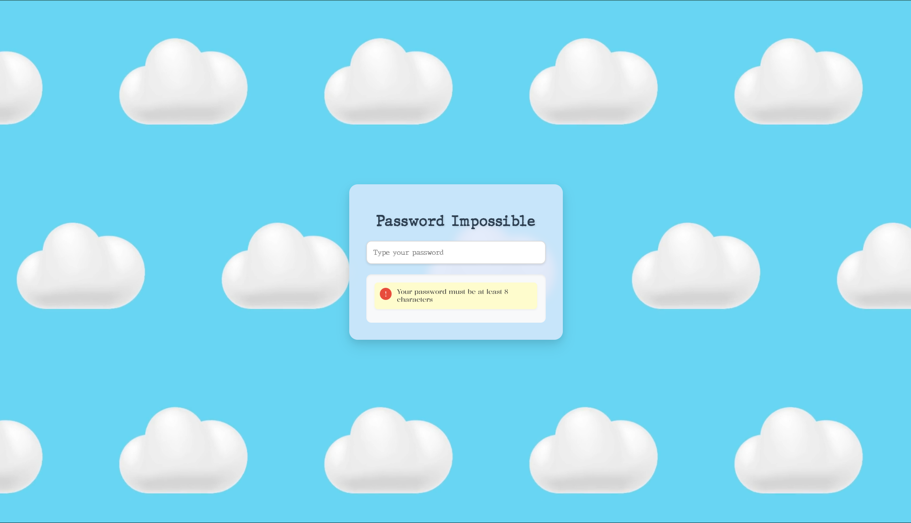
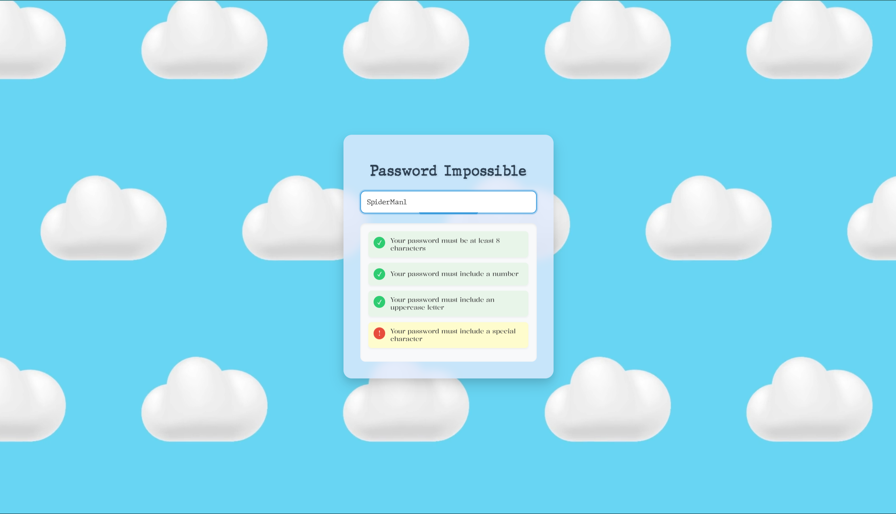
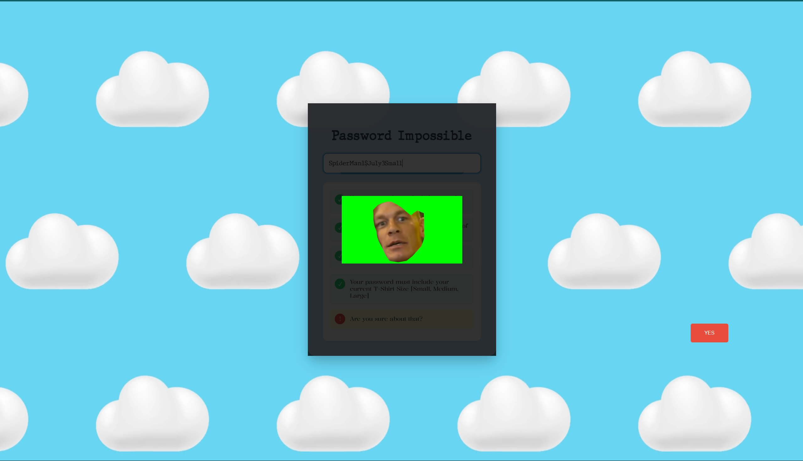
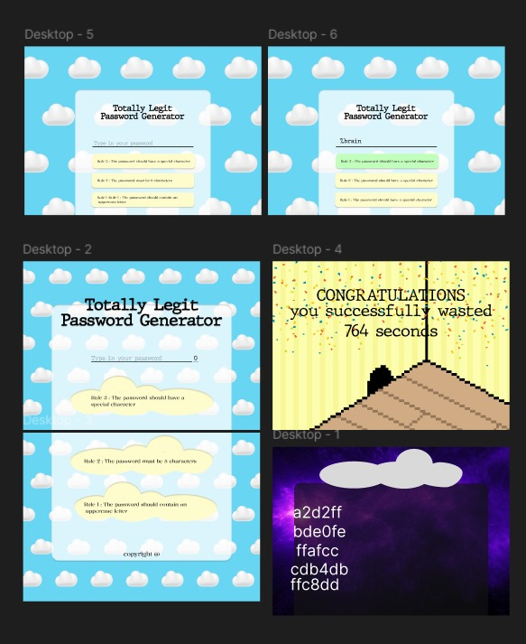

# Totally Legit Password Generator 🔐

## Basic Details
### Team Name: Clueless Avocados


### Team Members
- Team Lead: Christo Chery George - [College of Engineering, Chengannur]
- Member 2: Advika Rajeev - [College of Engineering, Chengannur]
- Member 3: Aneena J - [College of Engineering, Chengannur]

### Project Description
A deliberately frustrating password generator that takes the absurdity of website password requirements to the next level. It generates passwords so secure, even you won't be able to remember them! 

### The Problem (that doesn't exist)
Current password requirements are way too simple and user-friendly! Users are getting away with passwords that only need uppercase letters, numbers, special characters, their great-grandmother's maiden name, and their first pet's zodiac sign. We need to make this process MORE complicated!

### The Solution (that nobody asked for)
Introducing the Totally Legit Password Generator - where every password must contain:
- At least one hieroglyph
- A mathematical equation that proves P ≠ NP
- The exact GPS coordinates of where you had your first ice cream
- Three emojis that tell your life story
- A quote from a movie that bombed at the box office
- The chemical formula for your favorite food

## Technical Details
### Technologies/Components Used
For Software:
- Vue (To Fast Annoyance to Public)
- HTML/CSS (Making it look legitimately annoying)
- JavaScript (For real-time password strength depression)
- Claude + GPT - 4o 
### Implementation
# Installation
```bash
git clone https://github.com/gennyofficial/useless_project_temp.git
vue create useless_project_temp
cd useless_project_temp
```


*Users start out by solving a Simple 8 Character or Higher Criteria😊*


*Entered Password checks a set of criterias👀*


*Point at which you really question your life and wish you made better choices🤡*

# Diagrams

*The spiral of despair as users attempt to create a password that meets our requirements😈*


### Project Demo
# Video
[Watch Demo](images/demo.mp4)
*Watch our test users question their life choices as they try to generate passwords🙈*

(Due to Github File Limitations, kindly download the video to watch it function)

## Team Contributions
- Christo Chery George: Architected the core frustration engine
- Advika Rajeev: Designed the UI that makes users cry
- Aneena J: Implemented the impossible password validation rules

---
Made with 💻 (and a tiny bit of 😈) at TinkerHub Useless Projects 


